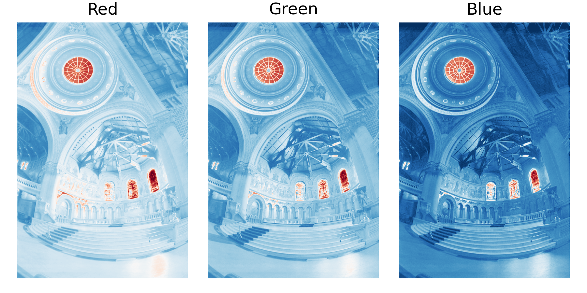
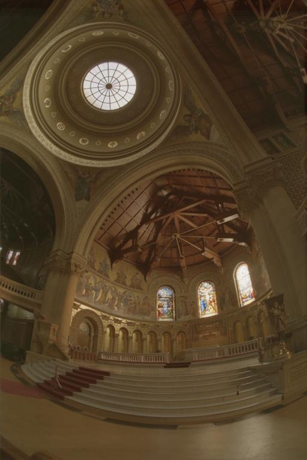

# imageFusion
 
|       |
| :-------------------------------------------: |
| *Log radiance maps per RGB channel* |

 Python implementation of ["Recovering High Dynamic Range Radiance Maps from Photographs"](https://dl.acm.org/doi/10.1145/258734.258884) (SIGGRAPH 1997).

The algorithm solves a system fo linear equations to recover the characteristic or Huter-Driffield curve from the exposure stack. The individual radiance maps (per channel) can be used to render a high dynamic range (HDR) image of the scene.

|       |
| :-------------------------------------------: |
| *Final HDR image obtained via fusion of sixteen exposure brackets* |

## Contents
---------------
```imageFusion.py```: Python implementation of the algorithm.
